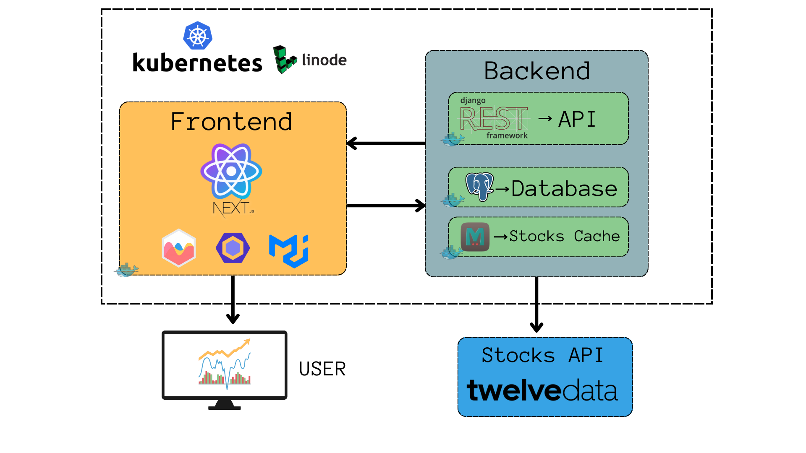

# Peridash

## About the Project

The Peridash project is a Stocks dashboard that fetches data from the [TwelveData API](https://twelvedata.com/). It's built with Django and React, both of which are popular and powerful frameworks for backend and frontend development respectively. The project is containerized using Docker, a platform that packages an application and its dependencies together in the form of containers to ensure that the application works seamlessly in any environment.

For package and dependency management, the project uses [PDM](https://pdm.fming.dev/), a modern Python package manager with PEP 582 support. It simplifies managing the dependencies of your Python projects.

[Docker Compose](https://docs.docker.com/compose/) is used to define and run multi-container Docker applications, which means the application does not need to rely on the host system's setup and can run independently, isolated from other applications running on the same system.

The project has a clear separation between the backend and frontend. 


### Architecture



### Backend

The backend of the project is powered by Django, specifically the Django REST Framework. This is used to create an API, which the frontend consumes. Django is a high-level Python Web framework that encourages rapid development and clean, pragmatic design.

PostgreSQL is used as the primary database for this project. PostgreSQL is a powerful, open-source object-relational database system with over 30 years of active development that has earned it a strong reputation for reliability, feature robustness, and performance.

Memcached is used for caching in order to speed up live data access times. Memcached is a high-performance, distributed memory object caching system, generic in nature, but intended for use in speeding up dynamic web applications by alleviating database load.

### Frontend

The frontend is built using Next.js, a popular framework for building React applications. It offers features like server-side rendering and generating static websites for React based web applications. It simplifies the development of complex user interfaces and optimizes performance.


## Setup

You start by cloning the repository to your local machine, this is a git operation which duplicates the codebase onto your local machine for you to work on.

Creating an `.env` file from the `.env.template` is the next step. The `.env` file is used to store sensitive data such as API keys, Database URIs, secret keys etc. In this project, you are required to get an API key from the TwelveData service and add it to this `.env` file.

## Running the project

Docker Compose is used to run the project. Docker Compose is a tool for defining and running multi-container Docker applications. First, you build the Docker images for the project using `docker compose build`. Docker images are lightweight, standalone, executable packages that include everything needed to run a piece of software, including the code, a runtime, libraries, environment variables, and config files.

Once the Docker images have been built, you can start the project using `docker compose up`. This command starts the services as defined in the `docker-compose.yml` file in the project root.

## Useful Commands

There are several helpful commands provided for interacting with the project. These commands involve running the backend and frontend, linting (checking for stylistic errors), formatting the code, and running tests. The use of Docker here allows the project to be run in an isolated environment.


### Backend

```bash

docker compose run backend pdm run python manage.py --help # Run django commands
docker compose run backend pdm lint # Lint the backend code
docker compose run backend pdm format # Format the backend code
docker compose run backend pdm test # Run backend tests
docker compese run backend pdm test_full # Run tests with coverage
```


### Frontend

```bash

docker compose run backend npm lint # Lint the frontend code
docker compose run backend npm format # Format the frontend code

```


## Making Changes

The rules for making changes and pushing them are well defined to ensure a smooth workflow. You're not allowed to push directly to the `main` branch. Instead, you should create a new branch, make your changes there, and then merge it back into `main`.

Before merging, you're advised to run the `git rebase main` command in your feature branch. This command will update your branch with the latest changes from `main` and let you resolve any conflicts that might have arisen due to changes in `main` after you had created your feature branch.

After resolving conflicts, you're required to run the `lint`, `format`, and `test` commands to ensure your code is clean, well-formatted, and working as expected.

Finally, you can make a merge request and assign a reviewer. The merge request can only be completed if all the automated checks (build, lint, test) are successful.